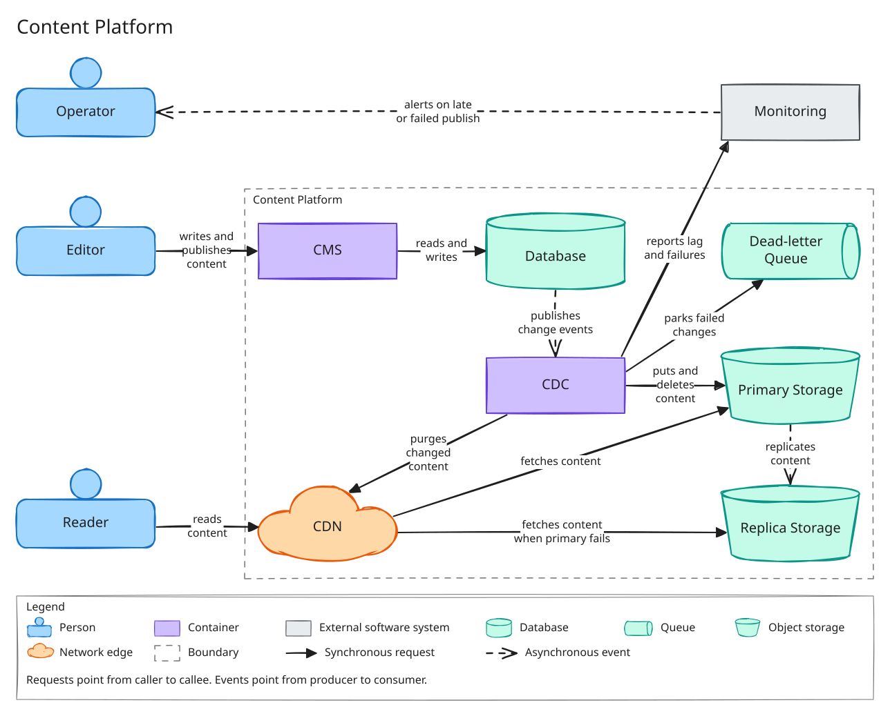

# Content Platform

Editors write and publish content in a content management system (CMS). Readers read published content through a CDN. Out of scope: authentication, the content model, and the editor interface.

## 1. Requirements

| ID | Requirement | Target | Met by |
|---|---|---|---|
| FR-1 | An editor can create content with the status draft. | n/a | CMS writes the content and its status to Database. |
| FR-2 | An editor can publish content. Its status changes from draft to published. | n/a | CMS sets the status in Database. |
| FR-3 | The system writes content to object storage when its status changes to published. | n/a | Change data capture (CDC) reads the change event from Database and puts the content in Primary Storage. |
| FR-4 | An editor can unpublish published content. | n/a | CMS sets the status in Database. |
| FR-5 | The system makes content unavailable in object storage when it is unpublished or deleted. | n/a | CDC deletes the object from Primary Storage. NFR-8 covers erasing earlier versions. |
| FR-6 | A reader can read published content. | n/a | CDN serves the content. It fetches from Primary Storage, or from Replica Storage when Primary Storage fails. |
| FR-7 | The system stops serving the previous version of content after it is published, unpublished or deleted. | n/a | CDC purges the changed content from CDN after it updates Primary Storage. |
| FR-8 | An editor can restore the previous published version of content. | n/a | CMS restores the earlier revision in Database. The change reaches readers through CDC like any publish. |
| FR-9 | An editor can edit content. | n/a | CMS writes the change to Database. |
| FR-10 | An editor can delete content. | n/a | CMS sets the status to deleted in Database. |
| NFR-1 | Performance: time to first byte for a reader. | p95 under 200 ms for a cached read | CDN answers a cached read without a request to any other element. Estimate: 100 ms network round trip (assumed) plus 20 ms in CDN (assumed) is 120 ms. |
| NFR-2 | Availability: readers can read published content when the CMS or the database is down. | 99.99% of read requests succeed per month | A read uses CDN, Primary Storage and Replica Storage only. With each storage region at 99.9% (assumed) and failing independently (assumed), both fail together 0.0001% of the time. CDN availability then sets the result, and it is assumed to be 99.99%. |
| NFR-3 | Consistency: a publish, unpublish or delete reaches readers within a bounded time. | Under 60 s from the status change, at p99 | CDC applies each change event and then purges CDN. Estimate: 10 s to receive the event, 5 s to update Primary Storage and 30 s for the purge is 45 s, which leaves 15 s. All three figures are assumed. A change parked in Dead-letter Queue misses the target and counts against the 1% that p99 allows. |
| NFR-4 | Scalability: the read path handles peak reader traffic. | 1,000 requests per second at peak | CDN serves cached reads and Primary Storage serves the rest. CMS and Database receive no reader traffic. Estimate: at a 90% cache hit ratio (assumed), Primary Storage receives 100 requests per second, and at most 1,000 with an empty cache. |
| NFR-5 | Durability: saved content is not lost. | No loss of content that the CMS has confirmed as saved, after the failure of one database node | CMS confirms a save after Database commits it on more than one node (assumed). |
| NFR-6 | Security: readers cannot read draft content. | Zero draft objects in object storage | CDC is the only writer to Primary Storage. It puts content only when the status is published. |
| NFR-7 | Operability: an operator is alerted when a publish is late. | Alert raised when a publish has not reached object storage 5 minutes after the status change | CDC reports publish lag and failed changes to Monitoring. Monitoring alerts Operator when lag exceeds 5 minutes, when Dead-letter Queue is not empty, or when CDC stops reporting. |
| NFR-8 | Retention: object storage keeps earlier versions of published content for restore, then erases them. | Kept for 90 days after a version is replaced or deleted, then erased | Primary Storage and Replica Storage version every object. An expiry rule erases a version 90 days after it is replaced or deleted. |

## 2. Design

The write path and the read path share no element except object storage. An editor changes content in CMS, which stores it in Database. CDC reads each status change from Database, updates Primary Storage, and purges CDN. Primary Storage replicates to Replica Storage in a second region. A reader's request goes to CDN, which fetches from object storage on a cache miss.

### 2.1 Container diagram

The diagram shows the containers of the Content Platform, the people who use it, and the external monitoring system. It answers how content travels from an editor to a reader.

**Failed changes.** CDC retries a change that it cannot apply. After the retry limit it parks the change in Dead-letter Queue and continues with later changes. An operator replays parked changes after the cause is fixed. A replay applies the content's current status from Database, not the parked event, so a replay cannot undo a later change.

**Repair.** CDC can republish any content from Database. This restores objects that are missing or wrong in Primary Storage. Object versions (NFR-8) cover the case where Database is not the correct source.

## 3. Trade-offs

| Choice | Over | Gains | Costs | Driven by |
|---|---|---|---|---|
| CDC writes published content to object storage | CMS writes to object storage when an editor publishes | Database is the only source of status. Every committed change reaches object storage, and any change can be replayed. | Publishing is asynchronous, up to 60 s. CDC is one more container to run and monitor. | FR-3, FR-5, NFR-3 |
| CDN fetches from object storage | CDN fetches from CMS | Reads do not depend on CMS or Database. | Published content is stored twice. Only content that is the same for every reader can be served. | NFR-2, NFR-4 |
| Replica Storage in a second region, with CDN failover | One object storage region | Reads continue when one region fails. | Storage cost is about twice that of one region. | NFR-2 |
| Replication by the storage service | CDC writes to both regions | CDC makes one write. Publishing does not depend on the second region. Both regions hold the same version history. | During a failure of Primary Storage, readers can receive content that is older by the replication lag, including content unpublished in that interval. NFR-3 gives way to NFR-2 for the length of the failure. | NFR-2, NFR-3 |
| CDC purges CDN on each change | A short cache lifetime | Changes reach readers within 60 s while unchanged content stays cached. | A failed purge leaves the previous version in CDN until the purge is retried. | FR-7, NFR-1, NFR-3 |
| Dead-letter Queue for changes that CDC cannot apply | Retrying a failed change until it succeeds | One failed change does not delay later changes. | A parked unpublish or delete leaves the content public until an operator replays it. FR-7 gives way to NFR-3 for that content, for as long as the change is parked. | FR-7, NFR-3, NFR-7 |
| An editor restores a previous version through CMS | An operator restores an earlier object version in object storage | Database and object storage stay consistent. The restore is purged and replicated like any publish. | CMS must keep revision history. A restore takes as long as a publish. | FR-8 |
| Object versions kept for 90 days | No object versions | Objects that are damaged or deleted in object storage can be recovered. | Unpublished and deleted content stays stored for up to 90 days. Storage holds every version from the last 90 days. | FR-5, NFR-8 |

## 4. Open questions

- Cost has no target. A monthly ceiling at the NFR-4 load would resolve it. This needs a chosen provider, the average request rate and the average object size.
- Assumption: 95% of readers are within a 100 ms network round trip of a CDN location, and CDN adds 20 ms. NFR-1 depends on it. The reader locations and the chosen CDN's coverage would confirm it.
- Assumption: the CDN provider commits to at least 99.99% availability. NFR-2 depends on it. The chosen provider's service commitment would confirm it. If it is lower, NFR-2 needs a second CDN.
- Assumption: each object storage region is available 99.9% of the time, and the two regions fail independently. NFR-2 depends on it. The chosen provider's service commitment would confirm it.
- Assumption: CDC receives an event within 10 s, updates Primary Storage within 5 s, and the CDN purge completes within 30 s. NFR-3 depends on it. Measurements with the chosen CDC method and CDN would confirm it.
- Assumption: replication lag between Primary Storage and Replica Storage is under 60 s. NFR-3 depends on it during a failure of Primary Storage. The chosen storage service's replication commitment would confirm it.
- Assumption: the cache hit ratio is 90%, and Primary Storage serves 1,000 requests per second. NFR-4 depends on it. The content's cache lifetime and the chosen storage service's request limits would confirm it.
- Assumption: Database stores a committed write on more than one node. NFR-5 depends on it. The choice of database and its replication setting would confirm it.
- Assumption: CMS keeps revision history in Database. FR-8 depends on it. The choice or design of the CMS would confirm it.
- Assumption: no deletion requires all versions to be erased before the 90-day retention period ends. FR-5 and NFR-8 depend on it. A legal or privacy removal requirement would disprove it and would need an immediate erase path in CDC.
- Question: does an edit to published content change the published version at once, or create a draft revision? The answer decides whether NFR-6 needs a rule for content that is published and has unpublished edits.
